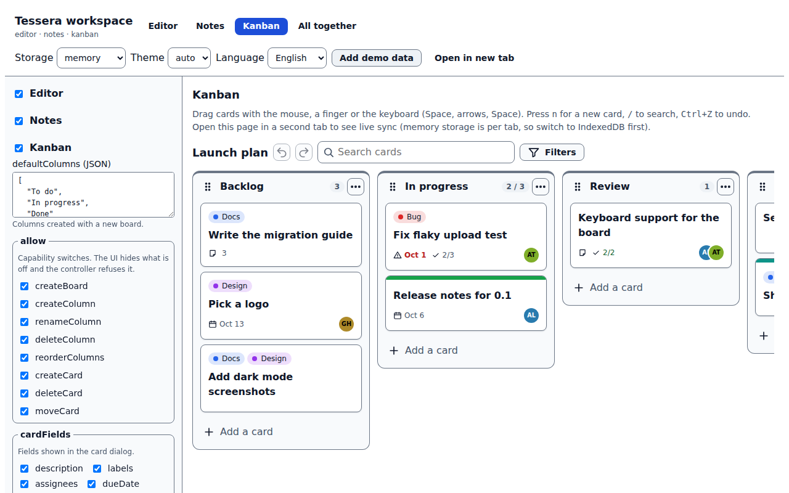
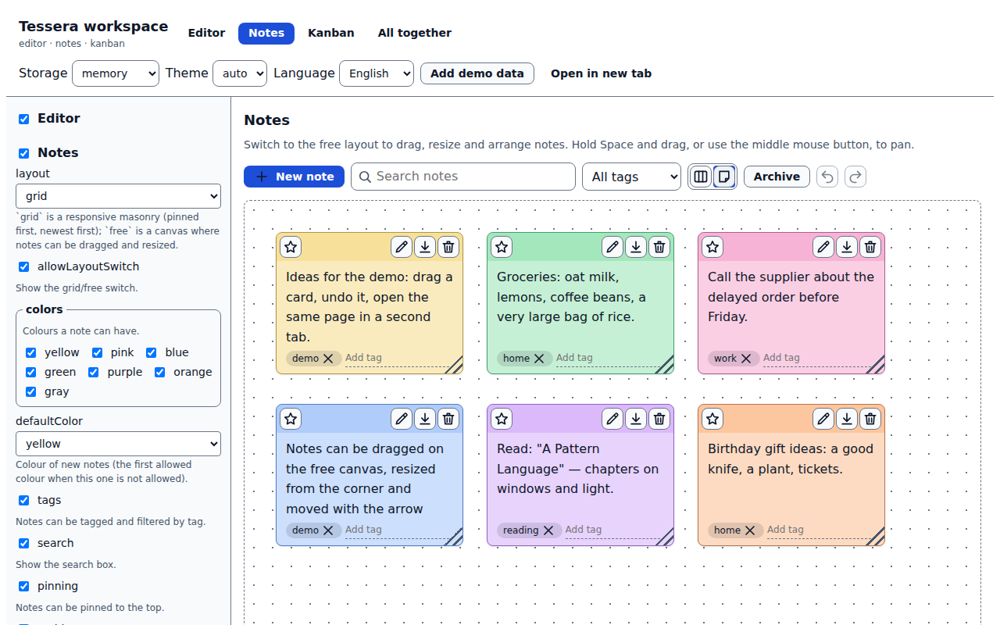
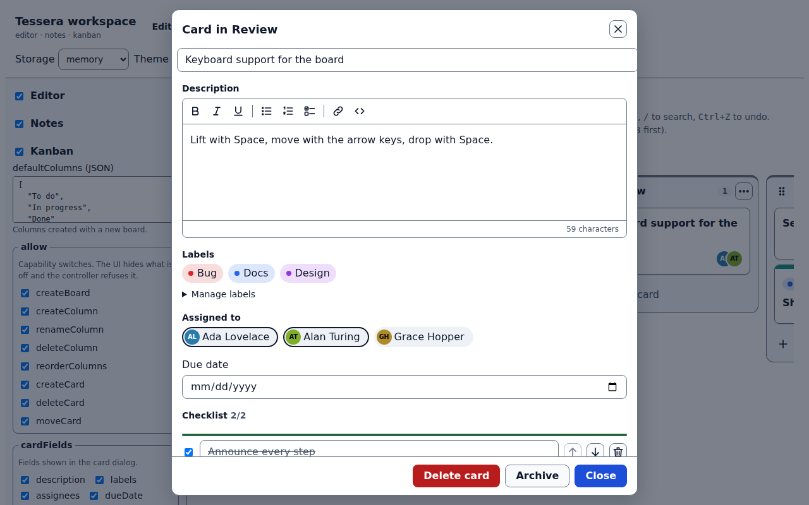
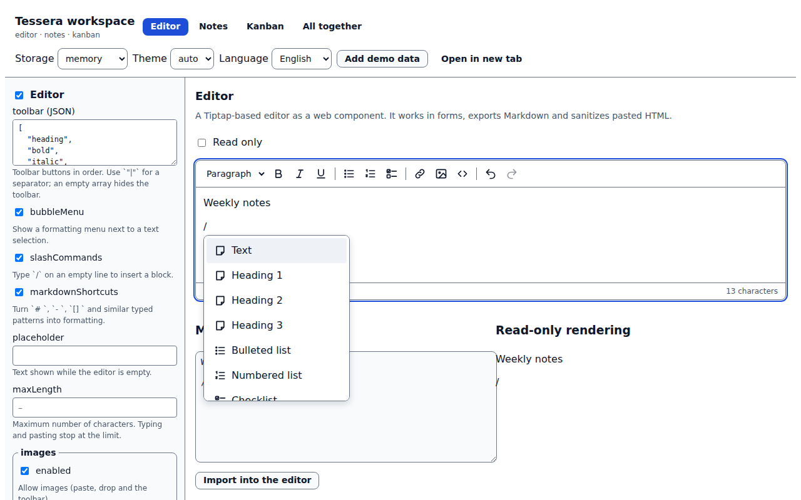

<h1 align="center">tessera-workspace</h1>

<p align="center"><b>A rich-text editor, sticky notes and a Kanban board as web components.</b> Part of the <a href="https://github.com/thakurabhishek7283/tessera">Tessera</a> kit family: switch a feature on with configuration, use it in any framework, keep the data in the browser or on your own backend.</p>

<p align="center">
  <a href="https://github.com/thakurabhishek7283/tessera-workspace/actions/workflows/ci.yml"></a>
  <a href="LICENSE"></a>
  · <a href="https://thakurabhishek7283.github.io/tessera-workspace/">Live demo</a>
</p>

<p align="center"></p>

## Why

Task boards, notes and rich text are in almost every collaborative app, and each one usually brings its own state handling, its own backend assumptions and its own framework wrapper. These kits sit on the small Tessera core instead. A drag, an edit or an undo goes through the same path whether the data lives in IndexedDB, in a REST service or in the tab next to yours, and a feature you do not enable never loads its code. The drag and drop works with a mouse, a finger and the keyboard, and the whole thing works offline.

## Packages

| Package | What it gives you | More |
| --- | --- | --- |
| [`@tessera-kit/editor`](packages/editor) | `<tessera-editor>`: toolbar, bubble menu, `/` menu, Markdown shortcuts, images, HTML and Markdown import and export, form support; `<tessera-rich-text>` for read-only display | [README](packages/editor/README.md) |
| [`@tessera-kit/notes`](packages/notes) | `<tessera-notes>`: sticky notes on a grid or a free canvas, with search, tags, pinning, colours and archive | [README](packages/notes/README.md) |
| [`@tessera-kit/kanban`](packages/kanban) | `<tessera-kanban>`: boards, columns, cards, WIP limits, labels, assignees, due dates, checklists, filters, undo and redo | [README](packages/kanban/README.md) |

Every package also has a headless API and a `/react` entry. The private packages `@tessera-internal/dnd`, `persist`, `react-wrap` and `test-utils` are bundled into the kits ([ADR 2](docs/decisions/0002-internal-packages-are-bundled.md)).

<table>
  <tr>
    <td></td>
    <td></td>
    <td></td>
  </tr>
</table>

## Quick start

The packages are not on npm yet, so build them from source first (see [Development](#development)). The snippets show the code you will write once they are installed.

### Any framework (Web Components)

```html
<script type="module">
  import '@tessera-kit/kanban/elements';
</script>

<tessera-kanban></tessera-kanban>
```

That is the whole setup. A bare element runs on Tessera's implicit default instance, which stores data in the browser and turns the feature on with its defaults. Use `<tessera-editor>` and `<tessera-notes>` the same way.

### React

```tsx
import { Kanban } from '@tessera-kit/kanban/react';
import { Notes } from '@tessera-kit/notes/react';
import { Editor } from '@tessera-kit/editor/react';

export function Workspace({ boardId }: { boardId: string }) {
  return (
    <>
      <Kanban board={boardId} onCardMove={(e) => audit(e.detail)} />
      <Notes />
      <Editor placeholder="Meeting notes…" onChange={(e) => save(e.detail.value.json)} />
    </>
  );
}
```

The wrappers render empty tags on the server and attach properties and events after mount, so they work with Next.js and other SSR setups.

### With other Tessera kits

```ts
import { createTessera } from '@tessera-kit/core';

const tessera = createTessera(
  {
    storage: { type: 'indexeddb' },
    features: {
      editor: { enabled: true, mentions: { enabled: true } },
      kanban: { enabled: true, wipLimits: true, allow: { deleteColumn: false } },
      notes: { enabled: true, layout: 'free' },
    },
  },
  {
    plugins: {
      editor: () => import('@tessera-kit/editor'),
      kanban: () => import('@tessera-kit/kanban'),
      notes: () => import('@tessera-kit/notes'),
    },
  },
);

tessera.on('kanban:card-moved', ({ card, toColumnId }) => console.log(card.title, '→', toColumnId));
tessera.disable('notes'); // later: its elements hide and its code stays unloaded
```

Put the elements under `<tessera-root>` (or `TesseraProvider` in React) so they use this instance. Swap `storage` for `{ type: 'rest', baseUrl }` to keep the data on [tessera-server](https://github.com/thakurabhishek7283/tessera-server) or any service that implements the same adapter.

## Configuration

The most used options. Every package README has the complete, generated table.

| Feature | Option | Default | Description |
| --- | --- | --- | --- |
| `editor` | `toolbar` | heading, bold, italic, … | Buttons in order; `"\|"` is a separator, `[]` hides the toolbar |
| `editor` | `maxLength` | none | Characters allowed; typing and pasting stop at the limit |
| `editor` | `images` | enabled | Paste, drop and toolbar upload with size and type limits |
| `kanban` | `defaultColumns` | `["To do", "In progress", "Done"]` | Columns of a new board |
| `kanban` | `wipLimits` | `true` | Refuse moves into a full column |
| `kanban` | `allow.*` | all `true` | Turn creating, moving, renaming and deleting on or off |
| `kanban` | `cardFields` | description, labels, … | Fields in the card dialog |
| `notes` | `layout` | `grid` | `grid`, or `free` for a canvas |
| `notes` | `pinning`, `archive`, `tags`, `search` | `true` | Individual note features |
| all | `sync` | `live` | Apply changes from other tabs and users as they happen |

[editor options](packages/editor/README.md#configuration) · [kanban options](packages/kanban/README.md#configuration) · [notes options](packages/notes/README.md#configuration)

## Events

| Where | Event | When |
| --- | --- | --- |
| `<tessera-kanban>` | `card-create`, `card-update`, `card-open` | After the card changed or its dialog opened |
| `<tessera-kanban>` | `card-move`, `card-delete` | **Cancelable**, before a move or a delete from the UI |
| `<tessera-notes>` | `note-create`, `note-update`, `note-delete` | After the change |
| `<tessera-editor>` | `change`, `input-commit`, `upload-error` | 300 ms after typing, on blur, when an image failed |
| bus | `kanban:*`, `notes:*` | Same changes plus `kanban:move-blocked` and `*:conflict`, for the host app |

DOM events bubble and are composed; bus events go through `instance.on(...)`.

## Architecture

```text
 <tessera-kanban>  <tessera-notes>  <tessera-editor>        elements (Lit, shadow DOM)
        │                 │                 │
   BoardController   NotesController   EditorHandle         commands + undo, state stores
        │                 │                 │
        └──── persist ────┘            lazy Tiptap engine   optimistic, version-checked writes
                 │
      @tessera-kit/storage (memory · localStorage · IndexedDB · REST)       from the tessera repo
```

Every kit has schemas, a controller that knows nothing about the DOM, a plugin that registers it with the core, and elements that render it. Cards and notes keep their order as fractional-index ranks, so a move writes one document and two people moving different cards never conflict. See [docs/architecture.md](docs/architecture.md) and the [decision records](docs/decisions).

## Development

```sh
nvm use                 # Node 22
corepack enable         # pnpm 10
pnpm deps               # fetches and builds tessera into external/ (or links ../tessera)
pnpm install
pnpm dev                # the playground at http://localhost:5173
pnpm check              # lint, typecheck, unit tests, build
pnpm test:browser       # component tests in Chromium
pnpm e2e                # end-to-end tests against the built playground
pnpm size               # bundle budgets
pnpm budget             # page budgets, every dependency included
```

[CONTRIBUTING.md](CONTRIBUTING.md) has the conventions. The playground has a config form for every feature, a storage selector (memory, localStorage, IndexedDB), a seed button that fills a demo board and notes, and an "Open in new tab" button to watch two tabs stay in sync.

## Roadmap

- [x] Editor with toolbar, bubble menu, slash menu, images, Markdown, sanitizing, forms and React
- [x] Sortable drag and drop for mouse, touch and keyboard, with announcements
- [x] Kanban with WIP limits, labels, assignees, due dates, checklists, filters, undo and redo, JSON import and export
- [x] Notes on a grid or a free canvas with search, tags, pinning and archive
- [x] Dark theme, English and German, axe checks in both themes
- [x] Live sync between tabs
- [ ] Rename and delete boards from the UI (the controller already supports renaming)
- [ ] Publish to npm
- [ ] Stretch: collaborative editing of card descriptions with Yjs over the realtime transport
- [ ] Stretch: swimlanes
- [ ] Stretch: calendar view of due dates

## Licence

MIT © Abhishek Thakur
